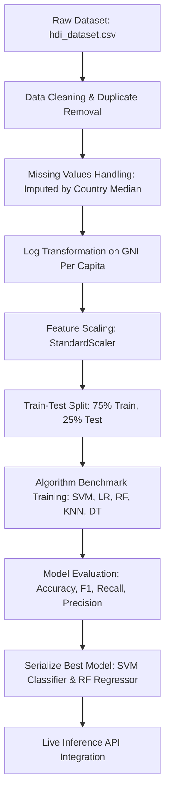

# 🌍 HDI Insight AI — Human Development Analytics Platform

[](https://www.python.org/)
[](https://flask.palletsprojects.com/)
[](https://scikit-learn.org/)
[](https://www.sqlite.org/)
[](LICENSE)

HDI Insight AI is a premium, enterprise-ready web analytics application that leverages advanced Machine Learning (ML) to predict the **Human Development Index (HDI)** category of a country in real-time. Designed for researchers, policymakers, academic evaluations, and portfolio display, the system integrates interactive data visualization, explainable AI (XAI) diagnostics, dynamic policy recommendations, and auto-generated PDF/CSV report exports.

---

## 📸 Screenshots & Interface Walkthrough

A complete gallery of visual walkthroughs is saved in the [Screenshots/](file:///c:/Users/Shahrukh/OneDrive/Desktop/HDI%20-%20Prediction%20System/Screenshots/) directory:

*   **Home Dashboard**: A modern, interactive analytics landing page showing country stats and recent prediction histories.
*   **Predictive Simulator**: Live inputs slider interface with real-time confidence gauges, HDI category output, and ML feature weights.
*   **Analytics Dashboard**: Visualizations of historical predictions and distribution of HDI categories.
*   **Country Comparison**: A side-by-side analysis comparison of simulated inputs against official country benchmarks.
*   **Dark Mode**: Sleek night-theme styling designed to reduce eye strain during prolonged analysis.

---

## 🛠 Detailed Features

*   **🔮 High-Accuracy HDI Category Prediction**: Evaluates human development level into low, medium, high, or very high classes based on country development indicators.
*   **📈 Continuous HDI Score Estimation**: A companion Random Forest Regressor estimates the exact continuous score index between `0.000` and `1.000`.
*   **🧠 Local Explainable AI (XAI)**: Calculates and visualizes individual feature contributions to the final prediction, highlighting which factor was most influential.
*   **⚖️ Prediction Confidence Gauge**: Interactive gauge component that shows the classification probability score calculated from the active Support Vector Machine model.
*   **📋 Intelligent Development Recommendations**: An automated policy advisory engine that evaluates the country profile against global medians, recommending actionable structural changes (e.g., healthcare funding, educational reform, economic diversification).
*   **🔍 Side-by-Side Country Comparison**: Compare your custom socioeconomic profile directly with real-world historical indicators of other nations.
*   **📊 Interactive Dashboard & Visualizations**: Charts illustrating prediction distribution and key indicators.
*   **💾 Historical Records Manager**: Persistent logging of previous simulations using an SQLite database backend, allowing users to view, search, export, or delete records.
*   **📄 Document Generation & Exports**: Download comprehensive, styled PDF reports of individual predictions and export full historical databases to CSV format.
*   **🌓 Unified Theme System**: Instant, smooth transition between Light Mode and Dark Mode styling.

---

## ⚙️ Technology Stack

| Component | Technology | Purpose / Application |
| :--- | :--- | :--- |
| **Programming Language** | Python 3.11+ | Back-end service scripting and data science logic |
| **Backend Web Framework**| Flask | Microservice architecture, REST APIs, and client-server routing |
| **Machine Learning** | Scikit-Learn | Preprocessing pipelines, classification (SVC), and regression (RF) |
| **Database Engine** | SQLite3 | Structured storage of persistent simulation history records |
| **Data Processing** | Pandas, NumPy | Mathematical computation, cleaning, log scaling, and dataset structures |
| **Inference Serialization**| Joblib | Standardized loading of trained model weights and feature scalers |
| **Visual Charting Engine** | Chart.js | Dynamic frontend charts, line logs, and comparison bar graphs |
| **Reporting Tool** | ReportLab | Server-side programmatic compilation of download-ready PDF reports |
| **Frontend Layout** | HTML5, CSS3 Variables, ES6 JS | Interface structuring, responsive grids, and dynamic theme switching |

---

## 📂 Repository Structure

The project directory is structured systematically following a professional Software Development Life Cycle (SDLC) layout:

```
HDI-Insights/
├── 01_Brainstorming/          # Ideation, primary objectives, and academic research docs
├── 02_Requirement_Analysis/   # Functional, non-functional, and hardware/software specifications
├── 03_Project_Design/         # System architecture, database layouts, mockups, and workflows
│   ├── Architecture.png       # Complete data flow and application architecture diagram
│   └── Workflow.png           # Machine Learning workflow flowchart
├── 04_Project_Planning/       # Project schedules, week-by-week timelines, and Gantt charts
├── 05_Project_Development/    # Source directory for the Flask web application
│   ├── app.py                 # Core server, API router, and business logic
│   ├── train_model.py         # Data preprocessing, pipeline benchmarks, and model serialization
│   ├── requirements.txt       # Back-end dependencies and library versions
│   ├── templates/             # UI Template files (index.html)
│   ├── static/                # Stylesheets (CSS), Javascript controls, and assets
│   ├── models/                # Serialized model bins (.joblib) and comparison records
│   ├── database/              # SQLite database storage files (hdi_history.db)
│   ├── dataset/               # Raw and cleaned socioeconomic training CSVs
│   └── utils/                 # Modular db manager and ReportLab PDF compilers
├── 06_Project_Testing/        # Verification cases, spreadsheets, and test execution summaries
├── 07_Project_Documentation/  # Final reports, manuals, installations, and PPTX slide decks
│   ├── Final_Report.pdf       # Formal academic and software thesis report
│   ├── User_Manual.pdf        # Screen-by-screen guide for analysts
│   ├── Installation_Guide.pdf # Developer deployment instruction manual
│   ├── Project_Presentation.pptx # 18-slide project review slide deck
│   └── README.md              # Premium documentation index folder mirror
├── 08_Project_Demonstration/  # System demo scripts and screen recordings
├── LICENSE                    # MIT license terms
└── README.md                  # Comprehensive root repository guide
```

---

## 🧠 Machine Learning Workflow

The analytical core of HDI Insight AI operates along a linear, deterministic pipeline:



1.  **Data Preprocessing**: Loads demographic and socioeconomic indicators. Missing values are filled based on country-specific medians, then global medians. Outliers are analyzed via Interquartile Range (IQR).
2.  **Feature Engineering**: GNI per Capita is log-transformed to stabilize the scale and improve model convergence. All features are centered and normalized via standard scaling.
3.  **Companion Inference**: Runs two models in parallel:
    *   *Support Vector Machine (RBF kernel)*: Predicts the primary developmental category.
    *   *Random Forest Regressor*: Provides a continuous HDI score estimate.
4.  **Explainability & Advisory**: Feature importance weights map the contribution of inputs. Insights are compared against global benchmarks to draft active policy recommendations.

---

## 📊 Model Performance Benchmarking

Our active **Support Vector Machine (SVM)** classifier achieves an overall **98.9% F1-score** on categorical predictions.

| Algorithm | Test Accuracy | Weighted Precision | Weighted Recall | Weighted F1-Score | Training Time (s) | File Size (KB) |
| :--- | :---: | :---: | :---: | :---: | :---: | :---: |
| **Support Vector Machine (Active)** | **98.9%** | **99.0%** | **98.9%** | **98.9%** | **0.050** | **27.0 KB** |
| Logistic Regression | 98.1% | 98.1% | 98.1% | 98.1% | 0.014 | 1.0 KB |
| Random Forest | 97.5% | 97.5% | 97.5% | 97.5% | 0.144 | 1,026.0 KB |
| K-Nearest Neighbors | 96.2% | 96.2% | 96.2% | 96.2% | 0.002 | 118.8 KB |
| Decision Tree | 95.6% | 95.7% | 95.6% | 95.6% | 0.003 | 12.2 KB |

---

## 🚀 Setup & Installation

Deploy the application locally by running the following commands in your shell:

### 1. Set Up the Project Environment
```bash
# Navigate to the development folder
cd 05_Project_Development

# Create virtual environment
python -m venv venv

# Activate virtual environment
# On Windows:
venv\Scripts\activate
# On macOS/Linux:
source venv/bin/activate

# Install dependencies
pip install -r requirements.txt
```

### 2. Model Training & Database Initialization
```bash
# Preprocess data, run benchmarks, and save models
python train_model.py
```

### 3. Launch Server
```bash
# Start the Flask web application
python app.py
```
*   Access the web interface at: **[http://localhost:5000/](http://localhost:5000/)**

### 4. Running Automated Tests
```bash
# Execute unit validation test suites
python -m unittest test_app.py
```

---

## 👥 Team Details & Contributions

| Member Name | Role | Primary Contributions |
| :--- | :--- | :--- |
| **Varigeti Karthikeya** (Team Lead) | Project Lead & Backend Architect | Project planning, Gantt schedules, Flask server routing, database design, API design |
| **Veera Ajay Kumar Adapa** | Machine Learning Engineer | Data cleaning, log scaling, model benchmarking, model training and serialization |
| **Gulla Chandana** | Frontend UX/UI Designer | Web interface, responsive CSS grid, theme switching, Chart.js visualization |
| **Ambati Krupa Jesudas** | QA & Test Engineer | Test cases validation, unit test setup, test reports, and edge-case boundary checks |
| **Mohammad Tayyab** | DevOps & Technical Writer | PDF report generation module, user manuals, deployment, and repository setup |

---

## 🔮 Future Scope

*   **🌍 Dynamic World Maps**: Implement Leaflet.js or D3.js to color-code countries dynamically based on their predicted/actual HDI categories.
*   **🔮 Time-Series Forecasting**: Incorporate ARIMA or LSTM neural networks to forecast future HDI indicators.
*   **🤖 Advanced XAI Integration**: Implement SHAP (SHapley Additive exPlanations) and LIME to generate advanced visual feature importance plots.
*   **🛡️ Multi-User Dashboard**: Add user authentication, administrative access controls, and cloud database synchronization.
*   **💬 AI Policy Chatbot**: Integrate a lightweight LLM assistant to chat and provide detailed policy advice based on predicted HDI.

---

## 📜 License

This project is licensed under the MIT License - see the [LICENSE](LICENSE) file for details.

---

## 🙏 Acknowledgements

*   **United Nations Development Programme (UNDP)** for providing the public Human Development Index dataset and methodology.
*   The open-source communities behind Flask, Scikit-Learn, and Chart.js.
